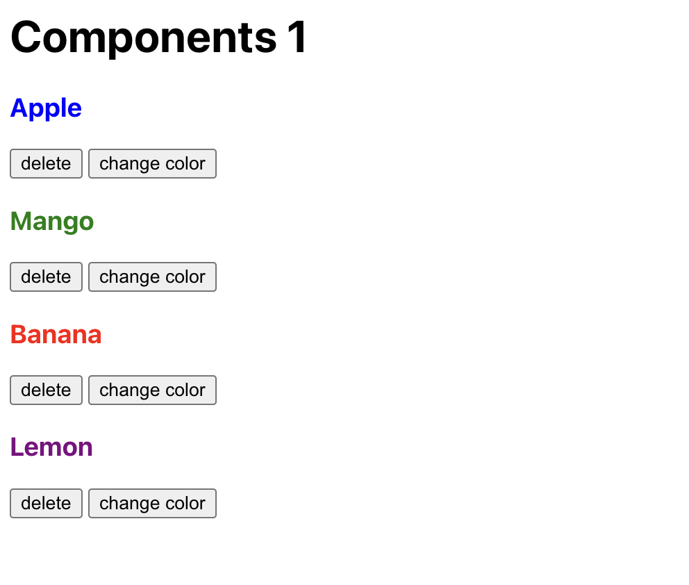

## Instructions for students:

### Create a Fruit Component

- Use the existing files `src/components/Fruit.js` to define the Fruit component
- Using your component, add 4 fruits to `src/App.js`
- The name of each fruit should have a random text color from this list: `["red", "blue", "green", "yellow", "purple"]`
- The user should be able to click the "change color" which should change the text color randomly to another color from the list.
- The user should be able to click the "delete fruit" button to remove a fruit

- image for reference:

**Bonus**

- The user should have the option to delete all

### Rules

- This is an individual assignment.
- Deadline: 1 hour.
- Use **Git properly**
- Feel free to document your code with comments.

[//]: # (autograding info start)
#  Results
> ⌛ Give it a minute. As long as you see the orange dot  on top, CodeBuddy is still processing. Refresh this page to see it's current status.
>
> This is what CodeBuddy found when running your code. It is to show you what you have achieved and to give you hints on how to complete the exercise.

### Fruit component

|                 Status                  | Check                                                                                    |
| :-------------------------------------: | :--------------------------------------------------------------------------------------- |
|  | Fruit component is defined in `src/components/Fruit.js` |
|  | Fruit component is used 4 times in `App.js` |

### Change color

|                 Status                  | Check                                                                                    |
| :-------------------------------------: | :--------------------------------------------------------------------------------------- |
|  | Fruit component has "change color button" |
|  | Fruit name changes color when "change color" button is clicked |

### Delete fruit

|                 Status                  | Check                                                                                    |
| :-------------------------------------: | :--------------------------------------------------------------------------------------- |
|  | Fruit component has "delete" button |
|  | Fruit is deleted when "delete" button is clicked |

[🔬 Results Details](../../actions)
[🐞 Tips on Debugging](https://github.com/DCI-EdTech/autograding-setup/wiki/How-to-work-with-CodeBuddy)
[📢 Report Problem](https://docs.google.com/forms/d/e/1FAIpQLSfS8wPh6bCMTLF2wmjiE5_UhPiOEnubEwwPLN_M8zTCjx5qbg/viewform?usp=pp_url&entry.652569746=SPA-FruitComponent)

[//]: # (autograding info end)